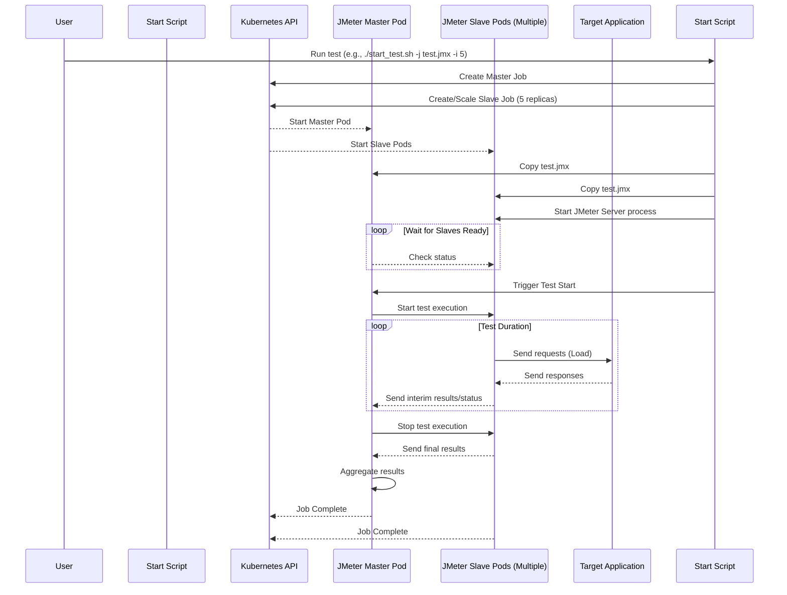

# Chapter 1: JMeter Distributed Testing Core

Welcome to the `jmeter-k8s-starterkit`! This project helps you run large-scale performance tests using Apache JMeter on a Kubernetes cluster.

Imagine you want to test how your website or application performs when *thousands* of users visit it at the same time. Running such a test from a single computer is often impossible – one machine just doesn't have enough power (CPU, memory, network bandwidth) to simulate that many users realistically.

This is where **JMeter Distributed Testing** comes in. It's the fundamental concept that allows us to overcome the limitations of a single machine and scale our tests.

## The Orchestra Analogy

Think of running a large performance test like conducting an orchestra:

*   **Conductor (JMeter Master):** You need one leader who has the musical score (the test plan), tells everyone when to start and stop, and listens to the overall performance.
*   **Musicians (JMeter Slaves):** You need many players who actually produce the sound (generate the test load). Each musician follows the conductor's instructions and plays their part.

In our `jmeter-k8s-starterkit`:

1.  The **JMeter Master** pod acts as the conductor. It holds the main test instructions (your `.jmx` file, which we'll discuss in the [Test Scenario Structure](02_test_scenario_structure_.md) chapter) and coordinates the entire test. It tells the slaves when to begin testing and gathers the results from them.
2.  The **JMeter Slave** pods are the musicians. There can be many slave pods (you can control how many!). Each slave pod runs a JMeter engine that executes the test plan and sends requests to your target application. They do the heavy lifting of simulating user traffic.

This setup allows us to distribute the load generation across multiple machines (Kubernetes pods), enabling us to simulate a much higher number of users than a single JMeter instance could handle.

## Key Components in Kubernetes

This Master/Slave architecture is implemented using standard Kubernetes resources, which are covered in more detail in the [Kubernetes Resource Orchestration](03_kubernetes_resource_orchestration_.md) chapter. For now, let's look at the core pieces:

1.  **JMeter Master Job (`jmeter-master.yaml`):** Defines how to run the conductor pod. It's a Kubernetes `Job`, meaning it's designed to run a task (controlling the test) and then complete.

    ```yaml
    # k8s/jmeter/jmeter-master.yaml (Simplified)
    apiVersion: batch/v1
    kind: Job # Runs a task to completion
    metadata:
      name: jmeter-master
      labels:
        jmeter_mode: master # Identifies this as the master
    spec:
      template:
        metadata:
          labels:
            jmeter_mode: master
        spec:
          containers:
          - name: jmmaster
            image: rbillon59/jmeter-k8s-base:5.6.2 # The JMeter software
            env:
            - name: MODE
              value: "MASTER" # Tells the container to run in master mode
            # ... Waits for a signal to start the test ...
            # ... Runs the test command using slaves ...
          restartPolicy: Never # Don't restart if it finishes or fails
    ```
    This configuration tells Kubernetes to create a Pod using the specified JMeter image and run it in "MASTER" mode.

2.  **JMeter Slave Job (`jmeter-slave.yaml`):** Defines how to run the musician pods. This is also a Kubernetes `Job`, but it's managed slightly differently; we often scale the *number* of slave pods up or down depending on how much load we need.

    ```yaml
    # k8s/jmeter/jmeter-slave.yaml (Simplified)
    apiVersion: batch/v1
    kind: Job # Runs a task to completion (the JMeter slave process)
    metadata:
      name: jmeter-slaves
      labels:
        jmeter_mode: slave # Identifies these as slaves
    spec:
      parallelism: 0 # We control the number of pods externally
      template:
        metadata:
          labels:
            jmeter_mode: slave
        spec:
          containers:
          - name: jmslave
            image: rbillon59/jmeter-k8s-base:5.6.2 # The same JMeter software
            env:
            - name: MODE
              value: "SLAVE" # Tells the container to run in slave mode
            ports: # Ports JMeter uses for communication
            - containerPort: 1099
            - containerPort: 50000
            # ... Runs the JMeter slave process waiting for commands ...
          restartPolicy: Never
    ```
    This defines the template for our slave pods. They run the same JMeter image but in "SLAVE" mode, ready to receive instructions from the master.

3.  **JMeter Slave Service (`jmeter-slave-service.yaml`):** Creates a stable network address for the master to find the slaves. Kubernetes pods can come and go, but this service provides a consistent way for the master to discover all currently running slave pods.

    ```yaml
    # k8s/jmeter/jmeter-slave-service.yaml (Simplified)
    apiVersion: v1
    kind: Service # Provides a stable network endpoint
    metadata:
      name: jmeter-slaves-svc
      labels:
        jmeter_mode: slave
    spec:
      clusterIP: None # Headless service - directly connects to pods
      selector:
        jmeter_mode: slave # Finds pods with the 'jmeter_mode: slave' label
      ports:
        - port: 1099 # JMeter control port
          name: jmeter
        - port: 50000 # JMeter data port (RMI)
          name: rmi
    ```
    This `Service` doesn't balance load; instead, it gives the master a list of all pods matching the `jmeter_mode: slave` label, allowing direct communication.

## How a Test Runs (Simplified View)

When you trigger a test using the `start_test.sh` script (provided in the kit):

1.  The script tells Kubernetes to create the Master Job and scale the Slave Job to the desired number of pods (e.g., 5 slaves).
2.  Kubernetes starts the Master pod and the 5 Slave pods.
3.  The script copies your test plan (`.jmx` file) to the Master pod and all Slave pods.
4.  The script tells the Slave pods to start their internal JMeter server process.
5.  The script tells the Master pod to start the test.
6.  The Master pod uses the `jmeter-slaves-svc` to find the IP addresses of the 5 Slave pods.
7.  The Master commands the Slaves (over ports 1099 and 50000) to begin executing the test plan.
8.  Each Slave pod independently sends requests to your target application, simulating user load.
9.  During the test, Slaves send status updates and summaries back to the Master.
10. When the test duration is reached (or manually stopped), the Master tells the Slaves to stop.
11. The Master aggregates the final results from all Slaves.
12. The Master job completes, and (optionally) generates a final HTML report. The Slave jobs also complete.

Here's a simplified diagram of the interaction:



## Conclusion

The JMeter Distributed Testing Core is the foundation of this starter kit. By using a Master pod to control multiple Slave pods running within Kubernetes, we can generate significant amounts of load to accurately test application performance under stress. This Master/Slave architecture, orchestrated by Kubernetes Jobs and Services, provides the scalability needed for serious performance testing.

Now that you understand the *how* (the distributed setup), let's dive into the *what* – the actual test plan that JMeter executes.

Next up: [Chapter 2: Test Scenario Structure](02_test_scenario_structure_.md)

---

Generated by [AI Codebase Knowledge Builder](https://github.com/The-Pocket/Tutorial-Codebase-Knowledge)