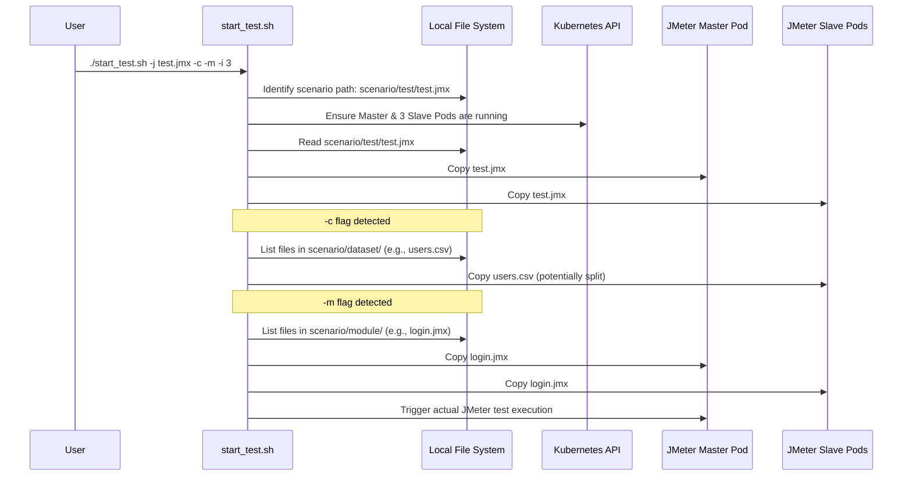

# Chapter 2: Test Scenario Structure

In the [previous chapter](01_jmeter_distributed_testing_core_.md), we learned about the core idea of JMeter distributed testing using a Master and many Slaves, like an orchestra conductor leading musicians. Now, we need to figure out where the "musical score" (our test plan) and all the supporting materials should live. Just like you organize your clothes in a closet or files on your computer, we need a standard way to organize our JMeter test files.

This chapter explains the specific folder structure that the `jmeter-k8s-starterkit` expects. Following this structure is crucial because the automation scripts rely on it to find and correctly distribute your test files to the JMeter Master and Slave pods.

## Why a Standard Structure?

Imagine you have a JMeter test plan (`.jmx` file), maybe some data files (like a list of usernames and passwords in a `.csv` file), and perhaps some reusable test pieces (called Modules or Include Controllers). When you run a test using the `start_test.sh` script, it needs to know exactly where to find these files so it can copy them to the right places inside the Kubernetes pods before the test starts.

Having a standard structure makes this process automatic and reliable. You place your files in the designated folders, and the script handles the rest.

## The `scenario/` Directory Structure

All your test-related files will live inside the main `scenario/` directory within the `jmeter-k8s-starterkit` project. Here's how it's organized:

```
jmeter-k8s-starterkit/
├── scenario/
│   ├── dataset/            # <-- Folder for shared test data files (e.g., CSVs)
│   ├── module/             # <-- Folder for reusable JMeter test fragments (.jmx)
│   └── your_test_name/     # <-- A folder named EXACTLY like your main test plan
│       └── your_test_name.jmx # <-- Your main JMeter test plan file
├── k8s/
├── aws/
├── start_test.sh
└── ... other project files
```

Let's break down the key folders inside `scenario/`:

1.  **`your_test_name/` Folder:**
    *   You need to create a folder inside `scenario/` that has the *exact same name* as your main JMeter test plan file, but without the `.jmx` extension.
    *   **Example:** If your main test plan is called `simple_load_test.jmx`, you must create a folder named `scenario/simple_load_test/`.
    *   Inside this folder, you place your main `.jmx` file (e.g., `scenario/simple_load_test/simple_load_test.jmx`).
    *   This is the primary test plan that the JMeter Master will execute.

2.  **`scenario/dataset/` Folder:**
    *   This folder is for any data files your test plan needs. The most common type is a CSV file used with JMeter's "CSV Data Set Config" element.
    *   **Example:** If your test needs a list of user credentials stored in `users.csv`, you place this file inside `scenario/dataset/users.csv`.
    *   When you run the test using the `-c` flag in `start_test.sh`, the script looks here for CSV files referenced in your main `.jmx` file and distributes them cleverly to the slave pods (often splitting them so each slave gets unique data).

3.  **`scenario/module/` Folder:**
    *   This folder is for reusable JMeter test fragments. In JMeter, you can create small, self-contained `.jmx` files (like a login sequence) and then include them in your main test plan using elements like "Include Controller" or "Module Controller".
    *   **Example:** If you have a reusable login process saved as `login_module.jmx`, you place it in `scenario/module/login_module.jmx`.
    *   When you run the test using the `-m` flag in `start_test.sh`, the script copies these modules to the pods so your main test plan can find and use them.

## How it Works in Practice

Let's say you want to run a test called `ecommerce_checkout.jmx`. This test simulates users logging in, browsing products, and checking out.

1.  **Main Test Plan:** You create the `ecommerce_checkout.jmx` file using the JMeter GUI.
2.  **Create Scenario Folder:** You create a folder named `scenario/ecommerce_checkout/`.
3.  **Place Main JMX:** You put `ecommerce_checkout.jmx` inside this folder: `scenario/ecommerce_checkout/ecommerce_checkout.jmx`.
4.  **Add User Data:** Your test needs usernames and passwords. You create a file `user_credentials.csv` with this data. You place it in the dataset folder: `scenario/dataset/user_credentials.csv`. Inside your `ecommerce_checkout.jmx`, your "CSV Data Set Config" element would simply reference `user_credentials.csv` as the filename.
5.  **Add Reusable Login:** You created a separate JMeter plan fragment for the login steps called `standard_login.jmx`. You place this in the module folder: `scenario/module/standard_login.jmx`. Inside `ecommerce_checkout.jmx`, you use an "Include Controller" and configure it to use `standard_login.jmx`.
6.  **Run the Test:** You execute the start script, telling it the name of your main test plan and indicating you're using datasets and modules:
    ```bash
    ./start_test.sh -j ecommerce_checkout.jmx -n default -c -m -i 5
    ```
    *   `-j ecommerce_checkout.jmx`: Specifies the main test plan.
    *   `-c`: Tells the script to look for and handle CSV files from `scenario/dataset/`.
    *   `-m`: Tells the script to look for and handle module files from `scenario/module/`.
    *   `-i 5`: Specifies the number of JMeter slave pods (as discussed in [Chapter 1](01_jmeter_distributed_testing_core_.md)).

The script now knows exactly where to find `ecommerce_checkout.jmx`, `user_credentials.csv`, and `standard_login.jmx` because you followed the standard structure. It will copy these files to the Master and Slave pods before starting the test.

## Under the Hood: What `start_test.sh` Does

The `start_test.sh` script acts as the orchestrator, using the folder structure conventions to prepare the test environment on the Kubernetes pods.

Here's a simplified view of how the script uses the structure:



The script uses shell commands to locate and copy the files. Here's a conceptual snippet (not exact code) from `start_test.sh`:

```bash
# --- Simplified start_test.sh logic ---

# 1. Get the JMX file name from the -j argument (e.g., "my_test.jmx")
jmx_file="$1"
scenario_name="${jmx_file%.jmx}" # Extracts "my_test"

# 2. Define the path to the main JMX file based on convention
main_jmx_path="scenario/${scenario_name}/${jmx_file}"

# 3. Copy the main JMX to all pods (using kubectl cp)
echo "Copying ${main_jmx_path} to Master and Slaves..."
# kubectl cp ${main_jmx_path} <master-pod>:/path/to/jmeter/bin/
# for slave_pod in <list_of_slave_pods>; do
#   kubectl cp ${main_jmx_path} ${slave_pod}:/path/to/jmeter/bin/
# done

# 4. If -c flag is present, copy datasets
if [ "$use_csv" = true ]; then
  echo "Copying datasets from scenario/dataset/..."
  # for slave_pod in <list_of_slave_pods>; do
  #   kubectl cp scenario/dataset/* ${slave_pod}:/path/to/jmeter/bin/ # Simplified - actual script might split CSVs
  # done
fi

# 5. If -m flag is present, copy modules
if [ "$use_modules" = true ]; then
  echo "Copying modules from scenario/module/..."
  # kubectl cp scenario/module/* <master-pod>:/path/to/jmeter/bin/modules/
  # for slave_pod in <list_of_slave_pods>; do
  #   kubectl cp scenario/module/* ${slave_pod}:/path/to/jmeter/bin/modules/
  # done
fi

# 6. Trigger the test on the Master pod...
# ...
```
This simplified example shows how the script constructs file paths based on the expected structure (`scenario/your_test_name/`, `scenario/dataset/`, `scenario/module/`) and uses commands like `kubectl cp` to transfer files into the running pods managed by [Kubernetes Resource Orchestration](03_kubernetes_resource_orchestration_.md).

## Conclusion

Organizing your JMeter test files using the standard `scenario/` structure (`your_test_name/your_test_name.jmx`, `dataset/`, `module/`) is essential for using the `jmeter-k8s-starterkit`. It allows the automation scripts (`start_test.sh`) to reliably find your main test plan, data files, and reusable modules, and distribute them correctly across the JMeter Master and Slave pods. This convention simplifies the process of running complex, distributed performance tests.

With the orchestra ready ([Chapter 1](01_jmeter_distributed_testing_core_.md)) and the musical score organized (this chapter), let's look closer at how the stagehands (Kubernetes) set up the stage for our performance.

Next up: [Chapter 3: Kubernetes Resource Orchestration](03_kubernetes_resource_orchestration_.md)

---

Generated by [AI Codebase Knowledge Builder](https://github.com/The-Pocket/Tutorial-Codebase-Knowledge)