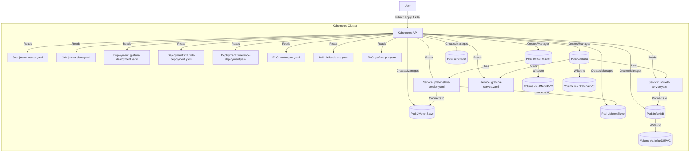

# Chapter 3: Kubernetes Resource Orchestration

In the [previous chapter](02_test_scenario_structure_.md), we learned how to organize our test plan files (`.jmx`, datasets, modules) so the `start_test.sh` script can find them. But once the script knows *what* to run, how does it actually set up the complex environment with JMeter Masters, Slaves, monitoring tools, and everything else needed for the test?

Think back to our orchestra analogy from [Chapter 1](01_jmeter_distributed_testing_core_.md). We have the conductor (Master), the musicians (Slaves), and maybe even sound engineers (monitoring tools). Someone needs to manage the whole stage – setting up chairs, ensuring instruments are ready, providing sheet music, and making sure everyone knows their part. In our `jmeter-k8s-starterkit`, that stage manager is **Kubernetes**.

Kubernetes (often shortened to "K8s") is the "container orchestrator" we use. Its job is to automatically deploy, scale, and manage all the different software pieces (running in containers) that make up our load testing environment. It does this by reading detailed instructions, like blueprints, that we provide in special configuration files.

## Blueprints for the Stage: YAML Files

Kubernetes doesn't magically know how to set up JMeter or Grafana. We have to tell it *exactly* what we want. We do this using configuration files written in a format called **YAML** (YAML Ain't Markup Language). Think of these YAML files as the blueprints or instruction manuals for Kubernetes.

Inside the `k8s/` directory of the `jmeter-k8s-starterkit`, you'll find several subdirectories (`jmeter/`, `tool/`) containing these YAML files. Each file describes a specific piece of our testing setup.

When we run scripts like `start_test.sh`, they use a command-line tool (`kubectl`) to send these YAML blueprints to the Kubernetes system. Kubernetes then reads the blueprints and builds the environment according to our specifications.

## Key Roles on the Kubernetes Stage

Kubernetes uses different types of "blueprints" (called *resources*) to manage different kinds of applications or tasks. For our starterkit, we primarily use these key Kubernetes resources:

1.  **Jobs: The Performers (JMeter Master & Slaves)**
    *   **What they are:** A Kubernetes `Job` is designed to run a specific task until it's finished, and then stop. Think of it like an actor performing a scene – they do their part, and then they're done.
    *   **Why we use them for JMeter:** Running a JMeter test is a finite task. The Master starts, coordinates the test, collects results, and finishes. The Slaves start, generate load for a specific duration, and then finish. `Jobs` are perfect for this "run-to-completion" behaviour.
    *   **Blueprint Example (`jmeter-master.yaml` - Simplified):**
        ```yaml
        # k8s/jmeter/jmeter-master.yaml
        apiVersion: batch/v1
        kind: Job         # Tells Kubernetes: "This is a task to run once"
        metadata:
          name: jmeter-master # The name of this specific Job
        spec:
          template:       # Describes the actual container(s) to run
            spec:
              containers:
              - name: jmmaster
                image: rbillon59/jmeter-k8s-base:5.6.2 # Which software image?
                env:
                - name: MODE
                  value: "MASTER" # Tell the container to act as Master
                # ... other container settings ...
              restartPolicy: Never # Don't restart if it finishes/fails
        ```
        This blueprint tells Kubernetes to create a container using the specified JMeter image, run it in "MASTER" mode, and consider the task complete when the container stops. A similar `Job` definition exists for the slaves (`jmeter-slave.yaml`).

2.  **Deployments: The Stage Crew (Monitoring & Mocking)**
    *   **What they are:** A Kubernetes `Deployment` is used for applications that need to run continuously. It ensures that a specified number of copies (replicas) of the application are always running. If one stops, the Deployment automatically starts another. Think of the stage crew who need to be available throughout the entire performance.
    *   **Why we use them:** Our monitoring tools ([Grafana](04_live_monitoring___reporting_stack_.md) and InfluxDB) and our [Mocking Service (Wiremock)](06_mocking_service__wiremock__.md) need to be running *before*, *during*, and *after* the JMeter test runs. We want them to be long-running services, so `Deployments` are the right choice.
    *   **Blueprint Example (`influxdb-deployment.yaml` - Simplified):**
        ```yaml
        # k8s/tool/influxdb/influxdb-deployment.yaml
        apiVersion: apps/v1
        kind: Deployment  # Tells Kubernetes: "Keep this running"
        metadata:
          name: influxdb   # The name of this Deployment
        spec:
          replicas: 1     # How many copies should always be running?
          selector:       # How to find the containers managed by this Deployment
            matchLabels:
              app: influxdb
          template:       # Describes the container(s) to run
            metadata:
              labels:
                app: influxdb # Label for the selector to find it
            spec:
              containers:
              - name: influxdb
                image: docker.io/influxdb:1.8 # Which software image?
                # ... other container settings ...
        ```
        This blueprint tells Kubernetes to ensure one copy (`replicas: 1`) of the InfluxDB container is always running. If the container crashes, Kubernetes will automatically restart it. Similar `Deployments` exist for Grafana and Wiremock.

3.  **Services: The Communication Lines**
    *   **What they are:** Kubernetes `Pods` (the actual running containers created by Jobs or Deployments) can be created and destroyed, and their internal network addresses (IP addresses) can change. A `Service` provides a stable, unchanging network address (like a fixed phone number) that other components can use to reliably communicate with the pods managed by a Job or Deployment.
    *   **Why we use them:**
        *   The JMeter Master needs a reliable way to find *all* the currently running JMeter Slave pods ([Chapter 1](01_jmeter_distributed_testing_core_.md)). The `jmeter-slaves-svc` Service provides this.
        *   Grafana needs a stable address to connect to the InfluxDB database ([Chapter 4](04_live_monitoring___reporting_stack_.md)). The `influxdb` Service provides this.
        *   JMeter Slaves (or the Master) need to send metrics to InfluxDB.
    *   **Blueprint Example (`jmeter-slave-service.yaml` - Simplified):**
        ```yaml
        # k8s/jmeter/jmeter-slave-service.yaml
        apiVersion: v1
        kind: Service     # Tells Kubernetes: "Create a stable network endpoint"
        metadata:
          name: jmeter-slaves-svc # The name of this Service
        spec:
          clusterIP: None # Special type: gives direct addresses of pods
          selector:
            jmeter_mode: slave # Finds pods with the label "jmeter_mode: slave"
          ports:
            - port: 1099      # The port number to connect to (JMeter RMI)
              name: jmeter
        ```
        This blueprint creates a special "headless" service. When the JMeter Master looks up `jmeter-slaves-svc`, Kubernetes gives it the individual IP addresses of all pods that have the label `jmeter_mode: slave`. Other services (like for InfluxDB or Grafana) might work slightly differently, acting more like a traditional load balancer with a single, stable IP.

4.  **PersistentVolumeClaims (PVCs): The Secure Storage**
    *   **What they are:** When a Kubernetes Pod (container) stops or is deleted, any data stored inside it is usually lost. This is like wiping the stage clean after a performance. But sometimes, we need data to *persist* even if the Pod goes away. A `PersistentVolumeClaim` (PVC) is a request for a piece of durable storage (like a network-attached hard drive) that Kubernetes provides. Pods can then attach to this storage.
    *   **Why we use them:**
        *   We want to save the final JMeter test results and HTML reports generated by the Master pod, even after the `jmeter-master` Job finishes.
        *   The InfluxDB database needs to store the monitoring data it collects. If the InfluxDB pod restarts, we don't want to lose all the metrics!
        *   Grafana might store user settings or dashboard configurations.
    *   **Blueprint Example (`jmeter-pvc.yaml`):**
        ```yaml
        # k8s/jmeter/jmeter-pvc.yaml
        apiVersion: v1
        kind: PersistentVolumeClaim # Tells K8s: "I need durable storage"
        metadata:
          name: jmeter-data-dir-pvc  # The name of this storage request
        spec:
          accessModes:
            - ReadWriteOnce        # How the storage can be accessed
          resources:
            requests:
              storage: 5Gi           # How much storage space do I need? (5 Gigabytes)
        ```
        This blueprint requests a 5Gi storage volume. Then, in the `jmeter-master.yaml` blueprint (and similarly in `influxdb-deployment.yaml` or `grafana-deployment.yaml`), we tell the Pod to mount and use this specific PVC:
        ```yaml
        # Inside jmeter-master.yaml's spec.template.spec
        volumes:
          - name: jmeter-data-dir # An internal name for the volume
            persistentVolumeClaim:
              claimName: jmeter-data-dir-pvc # Use the PVC we defined!
        containers:
          - name: jmmaster
            # ... other settings ...
            volumeMounts:
              - mountPath: /report # Mount the storage inside the container at /report
                name: jmeter-data-dir # Link to the volume defined above
        ```
        Now, any files the JMeter Master saves to its `/report` directory will actually be saved onto the persistent storage defined by `jmeter-data-dir-pvc`, ensuring they survive even after the Job completes.

## Putting It All Together

When you run the setup scripts provided by the starterkit (or use `kubectl apply -f <directory>` manually), you are essentially handing all these YAML blueprints to Kubernetes.



Kubernetes acts as the orchestrator:
1.  It reads the `Deployment` blueprints and creates the Pods for Grafana, InfluxDB, and Wiremock, ensuring they stay running.
2.  It reads the `Service` blueprints and sets up the stable network addresses so these components can find each other.
3.  It reads the `PersistentVolumeClaim` blueprints and provisions storage, attaching it to the appropriate Pods (like InfluxDB).
4.  When a test starts, it reads the `Job` blueprints and creates the JMeter Master and Slave Pods. The Master uses the `jmeter-slaves-svc` Service to find the Slaves. The Master saves results to its attached persistent storage (`jmeter-data-dir-pvc`).
5.  When the test finishes, the `Job` Pods complete and are eventually cleaned up, but the data saved to the PVCs remains. The `Deployment` Pods (Grafana, InfluxDB, Wiremock) keep running.

This orchestration handles the complexity of managing all these different pieces, ensuring they are created in the right way, can communicate with each other, and can store data persistently when needed.

## Conclusion

Kubernetes is the engine that drives the `jmeter-k8s-starterkit`. It acts as the "stage manager," using YAML blueprints to create and manage all the necessary components. We use different types of Kubernetes resources for different needs:
*   `Jobs` for finite tasks like running the JMeter Master and Slaves.
*   `Deployments` for long-running services like Grafana, InfluxDB, and Wiremock.
*   `Services` to enable reliable communication between these components.
*   `PersistentVolumeClaims` to provide stable storage for test results and monitoring data.

By defining our entire testing environment in these YAML files, we create a reproducible and automated setup that Kubernetes can manage for us. Understanding these basic Kubernetes concepts helps you see how the different parts of the starterkit fit together.

Now that we know how Kubernetes sets up the stage and manages the actors (JMeter) and stage crew (monitoring tools), let's take a closer look at the monitoring tools themselves.

Next up: [Chapter 4: Live Monitoring & Reporting Stack](04_live_monitoring___reporting_stack_.md)

---

Generated by [AI Codebase Knowledge Builder](https://github.com/The-Pocket/Tutorial-Codebase-Knowledge)