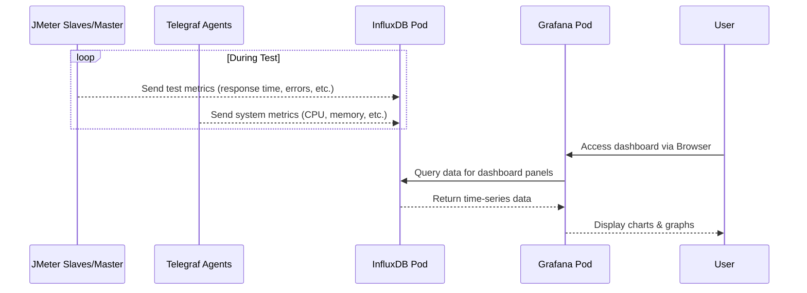

# Chapter 4: Live Monitoring & Reporting Stack

In the [previous chapter](03_kubernetes_resource_orchestration_.md), we saw how Kubernetes acts like a stage manager, setting up all the necessary components for our load test using YAML blueprints. Now, let's focus on a crucial part of that setup: the system that lets us watch the performance *while it's happening*.

Imagine driving a high-performance car. You wouldn't just floor the accelerator and hope for the best, right? You'd constantly glance at the dashboard – checking the speedometer, tachometer, temperature gauges – to understand how the car is behaving in real-time. Running a performance test without live monitoring is like driving that car blindfolded!

The **Live Monitoring & Reporting Stack** in `jmeter-k8s-starterkit` is exactly that dashboard for your load test. It allows you to see key metrics live as the test runs, helping you spot problems early and understand how your application (and the test infrastructure itself) is holding up under pressure.

## The Monitoring Crew: InfluxDB and Grafana

This monitoring stack consists of two main tools working together, deployed by Kubernetes as described in [Chapter 3](03_kubernetes_resource_orchestration_.md):

1.  **InfluxDB: The Data Recorder**
    *   Think of InfluxDB as the car's data logger or a very detailed logbook. Its job is to efficiently record **time-series data**. This is just a fancy way of saying it stores measurements along with the exact time they occurred.
    *   Examples of data stored:
        *   Response time of a specific user action (e.g., "Login") at 10:30:01 AM.
        *   Number of errors encountered at 10:30:02 AM.
        *   CPU usage of a JMeter slave pod at 10:30:03 AM.
        *   Number of active users simulated at 10:30:04 AM.
    *   JMeter (using a special component called the Backend Listener) and other agents like [Telegraf](05_metrics_collection_agent__telegraf__.md) continuously send these measurements to InfluxDB during the test.
    *   Because InfluxDB saves this data persistently (using Kubernetes Persistent Volumes, see [Chapter 3](03_kubernetes_resource_orchestration_.md)), you can also analyze the results *after* the test is finished.

2.  **Grafana: The Customizable Dashboard**
    *   If InfluxDB is the data recorder, Grafana is the beautiful, interactive dashboard display. It connects to InfluxDB (its data source), queries the specific data you want to see, and visualizes it using charts, graphs, gauges, and tables.
    *   **Customizable:** You can create your own dashboards or modify existing ones to show exactly the metrics you care about.
    *   **Live Updates:** Grafana dashboards automatically refresh, showing you the latest data coming into InfluxDB.
    *   **Pre-configured Dashboards:** The `jmeter-k8s-starterkit` comes with several pre-built Grafana dashboards, including:
        *   A JMeter dashboard showing key test metrics (response times, throughput, errors, active users).
        *   A Kubernetes resource monitoring dashboard.
        *   A system monitoring dashboard (showing CPU/memory of the test generator nodes, fed by [Telegraf](05_metrics_collection_agent__telegraf__.md)).
        *   JVM monitoring dashboards for JMeter and Wiremock.

## How it Works in Practice

1.  **Deployment:** When you deploy the starterkit using `kubectl apply -f k8s/`, Kubernetes creates the InfluxDB and Grafana components based on their YAML blueprints (`k8s/tool/influxdb/` and `k8s/tool/grafana/`). They run as continuous `Deployments` with persistent storage (`PVCs`) and stable network addresses (`Services`).
2.  **Test Execution:** As your JMeter test runs ([Chapter 1](01_jmeter_distributed_testing_core_.md)), the JMeter Master and Slaves are configured to send real-time results (like response times, success/failure counts per transaction) to the InfluxDB `Service`. Simultaneously, [Telegraf](05_metrics_collection_agent__telegraf__.md) agents might be sending system metrics (CPU, memory) to the same InfluxDB.
3.  **Viewing:** You access the Grafana dashboard through your web browser. Kubernetes typically exposes Grafana using a `LoadBalancer` Service (`k8s/tool/grafana/grafana-service.yaml`), which gives you an external IP address or DNS name. You log in (default credentials might need checking in secrets or documentation) and navigate to the pre-configured dashboards.
4.  **Observation:** You can watch the graphs update live, seeing trends like:
    *   Are response times increasing as the load ramps up?
    *   Are errors suddenly spiking?
    *   Are the JMeter slave pods running out of CPU or memory?
    *   How many users are currently active?

This immediate feedback is invaluable for understanding test progress and identifying potential bottlenecks or issues without waiting for the test to complete.

## Under the Hood: Data Flow and Configuration

Let's peek behind the curtain at how the data flows and how Kubernetes sets this up.

**Simplified Data Flow:**



**Kubernetes Configuration Snippets:**

*   **InfluxDB Deployment (`k8s/tool/influxdb/influxdb-deployment.yaml`):** Tells Kubernetes to keep one instance of InfluxDB running.
    ```yaml
    apiVersion: apps/v1
    kind: Deployment # Keep this running continuously
    metadata:
      name: influxdb
    spec:
      replicas: 1 # Ensure 1 copy is always running
      template:
        spec:
          containers:
          - name: influxdb
            image: docker.io/influxdb:1.8 # The InfluxDB software
            volumeMounts: # Connect to persistent storage
              - mountPath: /var/lib/influxdb
                name: var-lib-influxdb
          volumes:
            - name: var-lib-influxdb
              persistentVolumeClaim: # Use the PVC defined below
                claimName: influxdb-pvc
    ```
    This ensures the InfluxDB pod uses the persistent storage requested via the PVC.

*   **InfluxDB PVC (`k8s/tool/influxdb/influxdb-pvc.yaml`):** Requests storage for InfluxDB data.
    ```yaml
    apiVersion: v1
    kind: PersistentVolumeClaim # Request durable storage
    metadata:
      name: influxdb-pvc
    spec:
      accessModes: [ReadWriteOnce] # Can be mounted by one pod at a time
      resources:
        requests:
          storage: 5Gi # Request 5 Gigabytes
    ```
    This asks Kubernetes for 5Gi of storage that will survive pod restarts.

*   **InfluxDB Service (`k8s/tool/influxdb/influxdb-service.yaml`):** Gives InfluxDB a stable internal network name.
    ```yaml
    apiVersion: v1
    kind: Service
    metadata:
      name: influxdb # The stable name
    spec:
      clusterIP: None # Headless: Directly resolves to pod IPs (used by Grafana/JMeter)
      ports:
        - port: 8086 # InfluxDB default port
          protocol: TCP
          targetPort: 8086
      selector:
        app: influxdb # Find pods labeled 'app: influxdb'
    ```
    This allows Grafana and JMeter to reach InfluxDB using the simple address `http://influxdb:8086` inside the cluster.

*   **Grafana Deployment (`k8s/tool/grafana/grafana-deployment.yaml`):** Similar to InfluxDB, ensures Grafana stays running and uses its own PVC (`graf-data-dir-pvc`) for dashboards/settings. It also mounts ConfigMaps containing datasource and dashboard configurations.
    ```yaml
    apiVersion: apps/v1
    kind: Deployment
    metadata:
      name: grafana
    spec:
      replicas: 1
      template:
        spec:
          containers:
          - name: grafana
            image: docker.io/grafana/grafana:10.1.9 # The Grafana software
            volumeMounts: # Mount storage and configurations
              - name: data-dir # Grafana's internal data
                mountPath: /var/lib/grafana/
              - name: influxdb-datasource-provisioning # Datasource config
                mountPath: /etc/grafana/provisioning/datasources
              - name: influxdb-dashboard-provisioning # Dashboard config
                mountPath: /etc/grafana/provisioning/dashboards
              # ... other mounts for dashboard JSONs ...
          volumes:
            - name: data-dir
              persistentVolumeClaim:
                claimName: graf-data-dir-pvc # Grafana's storage
            - name: influxdb-datasource-provisioning # Get config from ConfigMap
              configMap:
                name: influxdb-datasource-provisioning
            - name: influxdb-dashboard-provisioning # Get config from ConfigMap
              configMap:
                name: influxdb-dashboard-provisioning
            # ... volume definitions for dashboard ConfigMaps ...
    ```

*   **Grafana Service (`k8s/tool/grafana/grafana-service.yaml`):** Exposes Grafana, often to the outside world.
    ```yaml
    apiVersion: v1
    kind: Service
    metadata:
      name: grafana
    spec:
      ports:
      - port: 443 # External port (HTTPS)
        targetPort: 3000 # Grafana's internal port
      selector:
        app: grafana # Find pods labeled 'app: grafana'
      type: LoadBalancer # Ask the cloud provider for an external IP/DNS
    ```
    The `LoadBalancer` type is key for user access. Kubernetes interacts with your cloud (like AWS, GCP, Azure) to create an external endpoint.

*   **Grafana Datasource Config (`k8s/tool/grafana/dashboard/grafana-provisioning-datasource-configmap.yaml`):** Tells Grafana how to connect to InfluxDB.
    ```yaml
    apiVersion: v1
    kind: ConfigMap
    metadata:
      name: influxdb-datasource-provisioning
    data:
      datasources.yaml: |-
        apiVersion: 1
        datasources:
        - name: Influx-Jmeter # Name seen in Grafana UI
          type: influxdb
          access: proxy # Grafana server proxies requests
          url: http://influxdb:8086/ # Use the InfluxDB service name!
          database: telegraf # Default database name used by starterkit
          # ... credentials might be here or in secrets ...
          isDefault: true
    ```
    This configuration file, mounted into the Grafana pod, automatically sets up the connection to the `influxdb` Service.

These Kubernetes resources work together to create a robust, persistent, and accessible monitoring system.

## Conclusion

The Live Monitoring & Reporting Stack, powered by InfluxDB and Grafana, is your eyes and ears during a performance test. InfluxDB diligently records time-stamped metrics sent from JMeter and other agents, while Grafana provides a dynamic, visual dashboard to observe this data in real-time. This allows for immediate feedback on test execution and system health. The persistent storage ensures data is available for later, more detailed analysis. The starterkit provides pre-configured dashboards to get you started quickly.

Understanding how this stack works helps you interpret the live results and diagnose issues effectively. But where does the system monitoring data (like CPU and memory usage of the machines running the test) come from? That's the job of our next component.

Next up: [Chapter 5: Metrics Collection Agent (Telegraf)](05_metrics_collection_agent__telegraf__.md)

---

Generated by [AI Codebase Knowledge Builder](https://github.com/The-Pocket/Tutorial-Codebase-Knowledge)