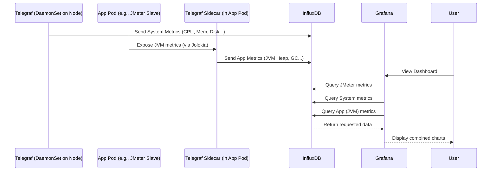

# Chapter 5: Metrics Collection Agent (Telegraf)

In the [previous chapter](04_live_monitoring___reporting_stack_.md), we learned about the dashboard (Grafana) and data recorder (InfluxDB) that let us watch our JMeter test results live. That's great for seeing *application* response times and errors. But what about the health of the system *running* the test? Are the machines (Kubernetes nodes) running out of CPU? Are the JMeter Slaves themselves struggling with memory? And can we get deeper insights into applications like JMeter or Wiremock, like their Java Virtual Machine (JVM) statistics?

To get this extra information, we need special agents collecting data from various places in our test environment. Think of these agents like **roving reporters** assigned to cover different aspects of the performance test event. In our `jmeter-k8s-starterkit`, this reporting job is handled by **Telegraf**.

## Telegraf: Your Metrics Reporters

Telegraf is a flexible agent designed specifically for collecting and sending metrics (measurements). In our starterkit, it plays two main roles:

1.  **System Reporters (on every Node):**
    *   Imagine placing a reporter in the lobby of every building (every Kubernetes node or machine) in your testing city. Their job is to constantly monitor the building's vital signs: how much electricity (CPU) is being used, how much space (memory, disk) is occupied, and how busy the network traffic is.
    *   In Kubernetes terms, we deploy these system reporters using a **DaemonSet** (`k8s/tool/telegraf/telegraf-daemonset.yaml`). A DaemonSet is a Kubernetes instruction that ensures *one copy* of a specific Pod (our Telegraf system reporter) runs on *every single node* in the cluster.
    *   These reporters gather generic system-level metrics for each machine.

2.  **Embedded Application Reporters (in specific Pods):**
    *   Now imagine assigning specialized reporters *inside* specific important departments (our application Pods like JMeter Master, JMeter Slaves, or [Wiremock](06_mocking_service__wiremock__.md)). These reporters have special access and tools to gather detailed information *specific* to that department's operations.
    *   For Java applications like JMeter and Wiremock, we want to collect **JVM (Java Virtual Machine)** metrics – things like memory usage within Java (Heap Memory), garbage collection activity, and thread counts. Telegraf can do this using a technology called **Jolokia**, which acts like an internal access point within the Java application.
    *   How do these reporters get inside? We use a clever Kubernetes tool called the **Telegraf Operator** (`k8s/tool/telegraf/telegraf-operator.yaml`). This operator watches for special labels or **annotations** (like sticky notes) that we add to our application Pod definitions (e.g., in `k8s/jmeter/jmeter-slave.yaml`). When it sees a Pod with the right annotation, the Operator automatically adds a Telegraf container (called a **sidecar**) right alongside the main application container within the same Pod. The annotation itself contains the specific instructions telling *this* Telegraf reporter what application-specific metrics to collect (like the Jolokia configuration).

## Sending Reports to Headquarters (InfluxDB)

Whether it's a system reporter on a node or an embedded reporter in an application pod, all Telegraf agents have the same final task: send their collected metrics data back to the central data recorder, **InfluxDB**, which we met in the [Live Monitoring & Reporting Stack](04_live_monitoring___reporting_stack_.md).

They send measurements tagged with details (like which node, which pod, which metric type) along with a timestamp. InfluxDB stores all this data.

Grafana can then query InfluxDB not just for JMeter results, but also for:
*   CPU/Memory usage of the Kubernetes nodes.
*   CPU/Memory usage of the individual JMeter Slave pods.
*   JVM Heap Memory usage of the JMeter Master.
*   Garbage collection frequency in the Wiremock service.
*   ... and much more!

This gives you a complete picture of your test environment's health, helping you understand if performance bottlenecks are in your application *or* in the testing infrastructure itself.

## Under the Hood: How Telegraf is Configured

Let's look briefly at how these two types of Telegraf reporters are set up.

**1. System Reporters (DaemonSet):**

Kubernetes runs these using a `DaemonSet` definition:

```yaml
# k8s/tool/telegraf/telegraf-daemonset.yaml (Simplified)
apiVersion: apps/v1
kind: DaemonSet # Ensures one pod per node
metadata:
  name: telegraf
spec:
  selector:
    matchLabels:
      name: telegraf # Finds pods with this label
  template: # Pod definition
    metadata:
      labels:
        name: telegraf # Label for the selector
    spec:
      serviceAccountName: telegraf # Permissions for K8s metrics
      containers:
        - name: telegraf
          image: docker.io/telegraf:1.30.1 # The Telegraf software
          env: # Environment variables for configuration
            - name: HOSTNAME # Get the node name
              valueFrom:
                fieldRef:
                  fieldPath: spec.nodeName
            # ... Variables for InfluxDB connection (from Secrets) ...
          volumeMounts: # Access node's filesystem for metrics
            - name: proc
              mountPath: /rootfs/proc # Mount node's /proc
              readOnly: true
            # ... other necessary mounts (sys, docker socket) ...
            - name: config # Mount the configuration file
              mountPath: /etc/telegraf
      volumes:
        # ... Volume definitions for node paths ...
        - name: config # Define the config volume
          configMap:
            name: telegraf # Use the 'telegraf' ConfigMap below
```
This tells Kubernetes to run the `telegraf:1.30.1` container image on every node, giving it access to the node's file system (`/proc`, `/sys`) to read system stats and mounting a configuration file.

The configuration itself comes from a `ConfigMap`:

```yaml
# k8s/tool/telegraf/telegraf-configmap.yaml (Simplified)
apiVersion: v1
kind: ConfigMap
metadata:
  name: telegraf # Name used by the DaemonSet volume
data:
  telegraf.conf: |+
    # Global settings
    [global_tags]
      env = "Kubernetes" # Tag all metrics with 'Kubernetes'
    [agent]
      hostname = "$HOSTNAME" # Use node name as hostname tag

    # Where to send metrics
    [[outputs.influxdb]]
      urls = ["http://$INFLUXDB_HOST:8086/"] # InfluxDB address (from env var)
      database = "$INFLUXDB_DB" # Database name (from env var)
      # ... credentials (from env vars) ...

    # What metrics to collect (Inputs)
    [[inputs.cpu]] # Collect CPU stats
      percpu = true
      totalcpu = true
    [[inputs.mem]] # Collect Memory stats
    [[inputs.disk]] # Collect Disk stats
    [[inputs.net]] # Collect Network stats
    [[inputs.kubernetes]] # Collect K8s specific stats (needs permissions)
    [[inputs.docker]] # Collect Docker stats (if applicable)
      endpoint = "unix:///var/run/docker.sock"
```
This config tells each Telegraf agent running via the DaemonSet to collect standard system inputs (`cpu`, `mem`, `disk`, `net`, etc.) and send them (`outputs.influxdb`) to the InfluxDB service address configured via environment variables (which are securely pulled from Kubernetes Secrets).

**2. Application Reporters (Operator & Annotations):**

Instead of a DaemonSet, we rely on the Telegraf Operator and annotations on the application pods.

First, the Telegraf Operator itself is deployed (`k8s/tool/telegraf/telegraf-operator.yaml`). We don't need to examine its internals, just know it's running and watching for annotations.

Then, look at an application definition, like the JMeter Slave Job:

```yaml
# k8s/jmeter/jmeter-slave.yaml (Pod Template Section - Simplified)
apiVersion: batch/v1
kind: Job
metadata:
  name: jmeter-slaves
spec:
  template:
    metadata:
      labels:
        jmeter_mode: slave
      annotations: # <<<--- Special instructions for the Operator!
        telegraf.influxdata.com/class: "app" # Use the 'app' class config
        telegraf.influxdata.com/inputs: |+ # Specific inputs for THIS app
          # Collect JVM metrics via Jolokia running inside the JMeter container
          [[inputs.jolokia2_agent]]
            urls = ["http://localhost:8778/jolokia"] # Jolokia endpoint

            # --- Specific JVM metrics to gather ---
            [[inputs.jolokia2_agent.metric]]
              name  = "java_memory" # Metric name in InfluxDB
              mbean = "java.lang:type=Memory" # Standard Java MBean
              paths = ["HeapMemoryUsage", "NonHeapMemoryUsage"] # Values to get

            [[inputs.jolokia2_agent.metric]]
              name     = "java_garbage_collector"
              mbean    = "java.lang:name=*,type=GarbageCollector"
              paths    = ["CollectionTime", "CollectionCount"]
              # ... other JVM metrics ...
    spec:
      containers:
      - name: jmslave # The main JMeter container
        image: rbillon59/jmeter-k8s-base:5.6.2
        # ... JMeter slave configuration ...
      # *** The Telegraf Operator will AUTOMATICALLY ADD a Telegraf sidecar container here ***
      # *** based on the annotations above. You don't define it manually. ***
```

What happens here:
1.  We define our normal JMeter slave container (`jmslave`).
2.  We add `annotations` to the pod metadata.
3.  The `telegraf.influxdata.com/class: "app"` annotation tells the Operator to use a base configuration (defined in the Operator's own setup, similar to the `app` class Secret in `k8s/tool/telegraf/telegraf-operator.yaml`, which mainly defines the InfluxDB output).
4.  The `telegraf.influxdata.com/inputs` annotation provides *additional* input configuration specific to this pod. Here, it defines the `inputs.jolokia2_agent` section to scrape JVM metrics from the Jolokia agent running within the `jmslave` container (the base JMeter image includes Jolokia).
5.  The Telegraf Operator sees these annotations when the JMeter Slave pod is created. It automatically injects a *second* container (the Telegraf sidecar) into the *same pod*. This Telegraf sidecar is configured with the base 'app' class settings (outputting to InfluxDB) *plus* the specific Jolokia inputs defined in the annotation.

The same annotation pattern is used in the JMeter Master (`k8s/jmeter/jmeter-master.yaml`) and Wiremock (`k8s/tool/wiremock/wiremock-deployment.yaml`) definitions to collect their respective JVM metrics.

**Simplified Data Flow Diagram:**



## Conclusion

Telegraf acts as our versatile metrics collection agent within the `jmeter-k8s-starterkit`. It runs in two ways:
*   As **system reporters** (via DaemonSet) on every Kubernetes node, collecting vital system health metrics (CPU, memory, disk, network).
*   As **embedded application reporters** (via Operator/Annotations/Sidecars) alongside specific applications like JMeter and Wiremock, collecting specialized data like JVM statistics using Jolokia.

All these collected metrics are sent to InfluxDB, enriching the data available in Grafana beyond just the basic JMeter results. This allows for comprehensive monitoring of both the test execution and the underlying infrastructure health, helping you pinpoint performance issues more effectively.

Now that we understand how we monitor JMeter and the system, let's look at another useful tool included in the starterkit: a service for simulating backend dependencies.

Next up: [Chapter 6: Mocking Service (Wiremock)](06_mocking_service__wiremock__.md)

---

Generated by [AI Codebase Knowledge Builder](https://github.com/The-Pocket/Tutorial-Codebase-Knowledge)