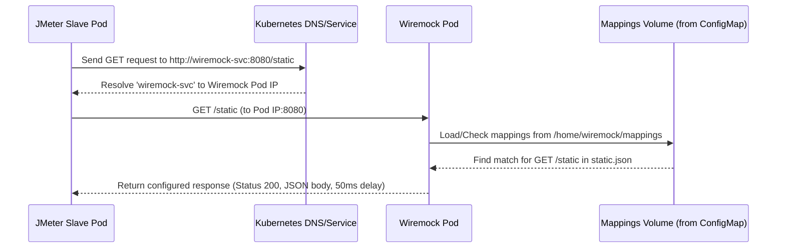

# Chapter 6: Mocking Service (Wiremock)

In the [previous chapter](05_metrics_collection_agent__telegraf__.md), we explored how Telegraf acts as our metrics reporter, gathering system and application health data. Now, let's tackle a common challenge in load testing: dealing with external services your application depends on.

## The Problem: Unreliable or Unavailable Neighbors

Imagine you're load testing the user interface (UI) of your shiny new e-commerce website. When a user clicks "View Product Details," your UI needs to fetch information from a separate backend "Product API".

What happens during your load test if:

*   The *real* Product API is down for maintenance?
*   The real Product API has strict limits on how many requests you can send per minute (rate limiting)?
*   The real Product API is slow, making it hard to tell if *your* UI is slow or if the bottleneck is external?
*   Calling the real Product API costs money for every request?

Testing against real external dependencies can make your load tests unreliable, unpredictable, expensive, or even impossible to run at scale.

## The Solution: Wiremock, the "Stunt Double" Service

This is where **Wiremock** comes to the rescue! Think of Wiremock as a highly configurable **stand-in** or **"stunt double"** for your real backend services (like the Product API in our example).

Instead of having your JMeter test scripts (or your application under test) hit the real, potentially troublesome API, you can point them to Wiremock instead. Wiremock runs inside your Kubernetes cluster as part of the `jmeter-k8s-starterkit`.

You tell Wiremock exactly how it should behave using **mappings**. A mapping is a rule that says: "When you receive *this specific kind of request*, respond with *this specific answer*."

**Benefits of using Wiremock:**

*   **Isolation:** Test your application's component (e.g., the UI) without needing the actual backend service to be running or available.
*   **Predictability:** Wiremock always responds exactly how you configure it, making your tests consistent and repeatable. No surprises from a slow or error-prone real service.
*   **Speed:** Wiremock responses are typically very fast, removing external latency from your test results.
*   **Control:** Simulate specific scenarios easily, like error responses (e.g., "Status 500 Internal Server Error") or slow responses (delays) to see how your application handles them.
*   **No External Limits:** Avoid hitting rate limits or incurring costs associated with real third-party APIs during testing.

## Key Concept: Mappings in a ConfigMap

The core idea behind Wiremock is its **mappings**. These are the instructions that define its behavior. In the `jmeter-k8s-starterkit`, these mappings are stored in a Kubernetes resource called a **ConfigMap**.

Think of a ConfigMap as a simple configuration file holder within Kubernetes. The starterkit includes a specific ConfigMap for Wiremock: `k8s/tool/wiremock/wiremock-configmap.yaml`.

Let's look at a very simple mapping defined inside this file:

```yaml
# k8s/tool/wiremock/wiremock-configmap.yaml (Simplified Snippet)
apiVersion: v1
kind: ConfigMap
metadata:
  name: wiremock-mapping # Name of the ConfigMap
data:
  static.json: |- # Name of the file containing the mapping
    {
      "request": {              # --- Define the incoming request ---
        "method": "GET",        # Match GET requests...
        "url": "/static"        # ...to the exact path "/static"
      },
      "response": {             # --- Define the outgoing response ---
        "status": 200,          # Send back HTTP Status 200 (OK)
        "fixedDelayMilliseconds": 50, # Wait 50ms before responding
        "jsonBody": {           # Send back this JSON data
          "data": [{
            "type": "product", "id": "1",
            "attributes": { "productName": "Raspberry PI", /* ... */ }
          }]
        }
      }
    }
  # ... other mappings like dynamic.json ...
```

**Explanation:**

1.  **`apiVersion: v1`, `kind: ConfigMap`:** Tells Kubernetes this is a ConfigMap resource.
2.  **`metadata: name: wiremock-mapping`:** Gives the ConfigMap a name.
3.  **`data: static.json: |-`:** This is the key part. `data` holds the configuration files. We're defining a file named `static.json` within the ConfigMap. The `|-` means the multi-line string that follows is the content of `static.json`.
4.  **`"request": { ... }`:** Describes the incoming request that this mapping should match. Here, it matches any `GET` request specifically to the URL path `/static`.
5.  **`"response": { ... }`:** Describes the response Wiremock should send if the request matches. Here, it sends a `200 OK` status, waits for 50 milliseconds, and returns a predefined JSON body representing product data.

You can define many `.json` files within this single ConfigMap, each containing one or more mappings. Wiremock will load all of them.

## Using Wiremock in Your Tests

1.  **Deployment:** Wiremock is automatically deployed when you apply the starterkit configurations:
    ```bash
    kubectl apply -f k8s/tool/wiremock/
    ```
    This creates the Wiremock `Deployment` (to run the Wiremock software), the `Service` (to give it a network address), and loads the `ConfigMap` with the mappings. The deployment process uses the concepts described in [Chapter 3: Kubernetes Resource Orchestration](03_kubernetes_resource_orchestration_.md).

2.  **Configuration:** Edit the `k8s/tool/wiremock/wiremock-configmap.yaml` file to add or modify mappings according to the needs of your test scenario. You define the expected requests and the desired fake responses.

3.  **Targeting Wiremock:** In your JMeter test plan (`.jmx` file), find the HTTP Request samplers that currently point to the *real* API. Change the "Server Name or IP" and "Port Number" to point to the Wiremock service running inside Kubernetes.
    *   **Server Name or IP:** `wiremock-svc` (This is the name defined in `k8s/tool/wiremock/wiremock-service.yaml`)
    *   **Port Number:** `8080` (This is the port Wiremock listens on by default)
    *   **Path:** Keep the same API path you want to simulate (e.g., `/static`, `/products/123`, `/users`).

    So, instead of `http://real-product-api.com/static`, your JMeter sampler will target `http://wiremock-svc:8080/static`.

Now, when your JMeter test runs, requests intended for the real API will hit your Wiremock stunt double instead. Wiremock will check its mappings, find the one matching the request (e.g., `GET /static`), and return the fake response you defined in the `wiremock-configmap.yaml`.

## Under the Hood: How Wiremock Works in K8s

Let's quickly see how the pieces fit together.

**Kubernetes Setup:**

*   **`wiremock-deployment.yaml`:** Tells Kubernetes to run the Wiremock software (using a container image like `rbillon59/wiremock-loadtest:latest`). Crucially, it mounts the `wiremock-mapping` ConfigMap as a volume inside the container. This makes the mapping files (`static.json`, etc.) available to the Wiremock process.

    ```yaml
    # k8s/tool/wiremock/wiremock-deployment.yaml (Simplified)
    apiVersion: apps/v1
    kind: Deployment
    metadata:
      name: wiremock
    spec:
      replicas: 1 # Run one instance
      template:
        # ... labels and annotations (like for Telegraf JVM monitoring)...
        spec:
          containers:
          - name: wiremock
            image: rbillon59/wiremock-loadtest:latest # Wiremock software
            ports:
            - containerPort: 8080 # Listens on port 8080
            volumeMounts: # <<<--- Mount the mappings ---<<<
            - name: wiremock-mapping # Internal volume name
              mountPath: /home/wiremock/mappings # Where mappings appear inside
            # ... other mounts (like for __files) ...
          volumes:
            - name: wiremock-mapping # Define the volume
              configMap:
                name: wiremock-mapping # <<<--- Use the ConfigMap ---<<<
            # ... other volume definitions ...
    ```

*   **`wiremock-configmap.yaml`:** As we saw, this holds the mapping definitions (the `.json` files).

*   **`wiremock-service.yaml`:** Provides a stable network name (`wiremock-svc`) for JMeter (or other components) to reach the Wiremock pod(s).

    ```yaml
    # k8s/tool/wiremock/wiremock-service.yaml
    apiVersion: v1
    kind: Service
    metadata:
      name: wiremock-svc # The stable network name
    spec:
      clusterIP: None # Headless: Directly resolves to Pod IPs
      ports:
        - port: 8080
          targetPort: 8080 # Forward traffic to pod's port 8080
      selector:
        type: mock # Find pods with the label "type: mock"
    ```
    A "headless" service (`clusterIP: None`) means that when you try to connect to `wiremock-svc`, Kubernetes gives your application (JMeter) the actual IP address(es) of the running Wiremock pod(s) that match the `selector`.

**Request Flow:**

Here's how a request from JMeter reaches Wiremock and gets a response:



Wiremock simply reads the mapping files from the volume mounted from the ConfigMap, finds the rule matching the incoming request, and sends back the predefined response.

*(Note: The starterkit also includes `wiremock-pod-autoscaler.yaml` which can automatically add more Wiremock pods if the mocking service itself comes under heavy load, but the basic concept remains the same).*

## Conclusion

Wiremock is an invaluable tool in your performance testing toolkit, acting as a reliable "stunt double" for backend services. By defining **mappings** in the `wiremock-configmap.yaml`, you tell Wiremock exactly how to respond to specific requests from your JMeter test plan. This allows for:

*   Isolated testing of your application components.
*   Predictable and repeatable test results.
*   Simulation of various backend behaviors (errors, delays).
*   Avoidance of external dependencies, rate limits, and costs.

Using Wiremock, configured via Kubernetes `Deployment`, `Service`, and `ConfigMap`, makes your load testing setup within the `jmeter-k8s-starterkit` more robust and flexible.

Now that we've covered the core components of the starterkit (JMeter, Kubernetes orchestration, Monitoring, Telegraf, and Wiremock), let's look at how to deploy this entire setup specifically on Amazon's Kubernetes service (EKS).

Next up: [Chapter 7: AWS EKS Deployment Scripts](07_aws_eks_deployment_scripts_.md)

---

Generated by [AI Codebase Knowledge Builder](https://github.com/The-Pocket/Tutorial-Codebase-Knowledge)