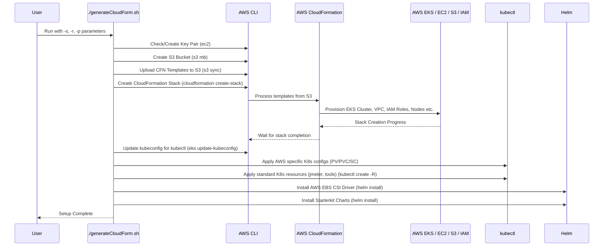
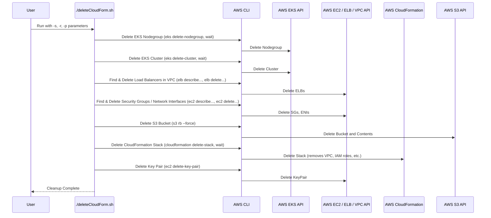

# Chapter 7: AWS EKS Deployment Scripts

Welcome to the final chapter! In [Chapter 6: Mocking Service (Wiremock)](06_mocking_service__wiremock__.md), we learned how to use Wiremock as a "stunt double" for backend services during our tests. Now, we'll tackle how to get the entire `jmeter-k8s-starterkit` environment up and running specifically on Amazon Web Services (AWS), using their managed Kubernetes offering called EKS (Elastic Kubernetes Service).

## The Challenge: Setting Up Kubernetes on AWS

Imagine you want to build a stage for our orchestra (JMeter Master/Slaves, monitoring tools) not just anywhere, but specifically in a large, feature-rich concert hall provided by AWS. This concert hall (AWS) has its own rules and requirements for setting up stages (Kubernetes clusters). You need to configure the hall's specific networking, security systems, storage rooms, and permissions before the orchestra can even start setting up their instruments.

Doing this manually involves many steps in the AWS console or using the AWS command-line interface (CLI). It's complex, time-consuming, and easy to make mistakes. We need an easier way!

## The Solution: Automated Installers for AWS EKS

The `jmeter-k8s-starterkit` provides specialized scripts located in the `aws/scripts/` directory that act like **automated installers** designed specifically for the AWS EKS environment. They handle the complexity of interacting with AWS to build (and later dismantle) the necessary infrastructure.

The two main scripts are:
1.  **`generateCloudForm.sh`**: The setup script. It builds the AWS concert hall stage (EKS cluster and related resources).
2.  **`deleteCloudForm.sh`**: The cleanup script. It tears down the stage and cleans up the resources so you don't keep paying for them.

These scripts rely heavily on a core AWS service called **AWS CloudFormation**.

### What is AWS CloudFormation?

Think of CloudFormation as AWS's system for using **blueprints** to build infrastructure. Instead of manually clicking buttons in the AWS console, you write (or use pre-written) blueprint files (called **templates**, usually in YAML format) that describe all the AWS resources you need (like networks, virtual machines, databases, security rules, and our EKS cluster).

You give this blueprint to CloudFormation, and AWS automatically builds everything exactly as described. The `generateCloudForm.sh` script uses the CloudFormation templates found in the `aws/templates/` directory.

## Using the Deployment Scripts

Before running these scripts, you need a few things set up on your local machine:

*   An AWS account with appropriate permissions.
*   The AWS Command Line Interface (CLI) installed and configured (`aws configure`) with credentials for your account.
*   `kubectl` (the Kubernetes command-line tool) installed.
*   `helm` (the Kubernetes package manager) installed.
*   `bash` (a common command-line shell).

### Setting Up the Stage: `generateCloudForm.sh`

This script automates the creation of the EKS cluster and all necessary AWS plumbing.

**How to run it:**

Navigate to the `aws/scripts/` directory in your terminal and run:

```bash
./generateCloudForm.sh -s my-jmeter-stack -r us-east-1 -p my-aws-profile
```

**Parameters:**

*   `-s`: A unique name for your CloudFormation stack (e.g., `my-jmeter-stack`). This helps organize the resources AWS creates.
*   `-r`: The AWS region where you want to build the cluster (e.g., `us-east-1`, `eu-west-1`). Choose a region geographically close to you or your users.
*   `-p`: The name of the AWS CLI profile to use (often `default`, unless you have multiple profiles configured).

**What happens (high level):**

The script will start interacting with AWS. It will:
1.  Create some temporary storage (an S3 bucket) to hold the CloudFormation blueprints.
2.  Tell CloudFormation to start building the stack based on the blueprints (`main.yml` and others in `aws/templates/`). This creates the EKS cluster, Virtual Private Cloud (VPC) network, security settings (IAM roles), and nodes (EC2 instances) for Kubernetes. This step can take 15-20 minutes or more.
3.  Configure your local `kubectl` command to connect to the newly created EKS cluster.
4.  Set up specific storage configurations needed for AWS (like the EBS CSI driver using Helm, which allows Kubernetes to use AWS's Elastic Block Store for persistent volumes).
5.  Deploy the standard `jmeter-k8s-starterkit` components (JMeter, Grafana, InfluxDB, etc.) onto your new EKS cluster using `kubectl apply` and `helm install`.

Once the script finishes successfully, your JMeter testing environment is ready to use on AWS EKS! You can then use the main `start_test.sh` script (as described in earlier chapters) to run your performance tests.

### Cleaning Up the Stage: `deleteCloudForm.sh`

Running cloud infrastructure costs money. Once you are finished with your testing, it's crucial to **clean up** the AWS resources to avoid unexpected bills. The `deleteCloudForm.sh` script automates this teardown process.

**How to run it:**

Navigate to the `aws/scripts/` directory and run:

```bash
./deleteCloudForm.sh -s my-jmeter-stack -r us-east-1 -p my-aws-profile
```

**Parameters:**

*   Use the **exact same** stack name (`-s`), region (`-r`), and profile (`-p`) that you used with `generateCloudForm.sh`.

**What happens (high level):**

The script will:
1.  Instruct AWS to delete the EKS cluster and its associated node groups.
2.  Clean up dependencies like Load Balancers and Security Groups created within the VPC.
3.  Tell CloudFormation to delete the stack, which removes the core infrastructure (VPC, IAM roles, etc.).
4.  Delete the temporary S3 bucket created during setup.
5.  Delete the EC2 Key Pair created for accessing nodes (if needed).

This process can also take several minutes. **Always** run this script when you are done testing to ensure resources are properly removed.

## Under the Hood: How `generateCloudForm.sh` Works

Let's peek behind the curtain of the setup script.

**Simplified Workflow:**



**Code Snippets (Conceptual):**

1.  **Upload Templates & Create Stack:**
    ```bash
    # scripts/generateCloudForm.sh (Simplified)

    # Define S3 bucket name based on stack name
    bucket_name=${stack_name}-cloudform

    # Create bucket and upload templates from aws/templates/
    aws s3 mb s3://${bucket_name} --profile ${profile}
    aws s3 sync ./templates s3://${bucket_name} --profile ${profile}

    # Tell CloudFormation to create the stack using the main template in S3
    aws cloudformation create-stack \
        --stack-name ${stack} \
        --template-url https://${bucket_name}.s3.${region}.amazonaws.com/main.yml \
        --parameters ParameterKey=stack_name,ParameterValue=${stack} \
        --capabilities CAPABILITY_NAMED_IAM \
        --profile ${profile}

    # Wait until the stack creation is finished
    aws cloudformation wait stack-create-complete --stack-name ${stack} --profile ${profile}
    ```
    This part prepares the blueprints and asks CloudFormation to build the main infrastructure. `CAPABILITY_NAMED_IAM` acknowledges that the template will create security roles.

2.  **Configure `kubectl`:**
    ```bash
    # scripts/generateCloudForm.sh (Simplified)

    # Get connection details from the new EKS cluster and configure kubectl
    aws eks update-kubeconfig --name ${stack}-eks --region ${region} --profile ${profile}
    ```
    This crucial step makes your local `kubectl` tool aware of the new cluster in AWS.

3.  **Apply Kubernetes Configs & Tools:**
    ```bash
    # scripts/generateCloudForm.sh (Simplified)

    # Copy AWS-specific volume configurations (like StorageClass)
    # from aws/aws-files/ into the main k8s/ directory
    cp -r ../aws-files/grafana/* ../../k8s/tool/grafana
    cp -r ../aws-files/jmeter/* ../../k8s/jmeter
    # (Script also patches the VolumeId into jmeter-pv.yaml - simplified here)

    # Go to the main project directory
    cd ../../

    # Apply all standard Kubernetes manifests from the k8s/ directory
    kubectl create -R -f k8s/

    # Add Helm repositories (locations for downloadable charts)
    helm repo add aws-ebs-csi-driver https://kubernetes-sigs.github.io/aws-ebs-csi-driver
    # ... add starterkit repo ...
    helm repo update

    # Install the AWS EBS CSI driver using Helm (enables persistent storage)
    helm install aws-ebs-csi-driver aws-ebs-csi-driver/aws-ebs-csi-driver
    # Install starterkit components via Helm
    helm install jmeter-k8s-starterkit-helm-charts/jmeter-k8s-starterkit --generate-name

    # Return to the script directory
    cd aws/scripts
    ```
    This section applies both the AWS-specific storage setup (`StorageClass` pointing to `ebs.csi.aws.com`) and the standard Kubernetes resources (Jobs, Deployments, Services for JMeter, Grafana, etc.) discussed in [Chapter 3: Kubernetes Resource Orchestration](03_kubernetes_resource_orchestration_.md). It uses Helm for managing the EBS CSI driver and potentially other parts of the application stack.

## Under the Hood: How `deleteCloudForm.sh` Works

The cleanup script essentially reverses the process, carefully deleting AWS resources in an order that respects dependencies.

**Simplified Workflow:**



**Code Snippets (Conceptual):**

The `deleteCloudForm.sh` script primarily uses AWS CLI commands. Here's the gist:

1.  **Delete EKS Components:**
    ```bash
    # scripts/deleteCloudForm.sh (Simplified)

    # Delete the nodegroup first
    aws eks delete-nodegroup --cluster-name ${stack}-eks --nodegroup-name ${stack}-eks-nodegroup --profile ${profile}
    aws eks wait nodegroup-deleted ...

    # Then delete the cluster control plane
    aws eks delete-cluster --name ${stack}-eks --profile ${profile}
    aws eks wait cluster-deleted ...
    ```
    It's important to delete the nodes before the control plane.

2.  **Clean Up VPC Dependencies:** (This is complex, the script handles finding and deleting resources like Load Balancers, Security Groups, and Network Interfaces automatically created by Kubernetes services of type LoadBalancer or by the EKS cluster itself within the VPC managed by CloudFormation).
    ```bash
    # scripts/deleteCloudForm.sh (Simplified Logic)

    # Find VPC ID associated with the stack
    vpc_Id=$(aws ec2 describe-vpcs --filters Name=tag:Name,Values=${stack}-VPC ...)

    # Find and delete Load Balancers in that VPC
    load_balancers=$(aws elb describe-load-balancers --query "...VPCId=='${vpc_id}'..." )
    # for lb in $load_balancers; do aws elb delete-load-balancer ... ; done

    # Find and delete Security Groups & associated Network Interfaces
    security_groups=$(aws ec2 describe-security-groups --filters "Name=vpc-id,Values=${vpc_id}" ...)
    # for sg in $security_groups; do
    #   find network interfaces using sg
    #   detach and delete interfaces
    #   aws ec2 delete-security-group --group-id $sg ...
    # done
    ```
    This cleanup is necessary because CloudFormation often can't delete a VPC if these dependent resources still exist.

3.  **Delete S3 Bucket and CloudFormation Stack:**
    ```bash
    # scripts/deleteCloudForm.sh (Simplified)

    # Define bucket name
    bucket_name=$(aws sts get-caller-identity ...)-${stack}-cloudform

    # Force deletion of the S3 bucket and its contents
    aws s3 rb s3://${bucket_name} --force --profile ${profile}

    # Delete the main CloudFormation stack
    aws cloudformation delete-stack --stack-name ${stack} --profile ${profile}
    aws cloudformation wait stack-delete-complete --stack-name ${stack} --profile ${profile}
    ```
    This removes the temporary storage and triggers AWS to delete the core infrastructure defined in the templates.

## Conclusion

Setting up a full Kubernetes environment on AWS EKS involves many steps specific to the AWS cloud. The `jmeter-k8s-starterkit` simplifies this significantly by providing the `generateCloudForm.sh` and `deleteCloudForm.sh` scripts.

*   `generateCloudForm.sh` uses AWS CloudFormation blueprints (`aws/templates/`) to automatically provision the EKS cluster, configure networking and security, set up AWS-specific storage integration (EBS CSI driver), and deploy the starterkit components.
*   `deleteCloudForm.sh` automates the teardown of all created AWS resources, preventing unnecessary costs.

These scripts act as your specialized installer and uninstaller for running the `jmeter-k8s-starterkit` within the AWS ecosystem, letting you focus more on designing and running your performance tests.

This concludes our journey through the `jmeter-k8s-starterkit`! We've covered the core distributed testing concepts, test structure, Kubernetes orchestration, monitoring, metrics collection, mocking, and finally, deployment onto AWS EKS. Happy testing!

---

Generated by [AI Codebase Knowledge Builder](https://github.com/The-Pocket/Tutorial-Codebase-Knowledge)