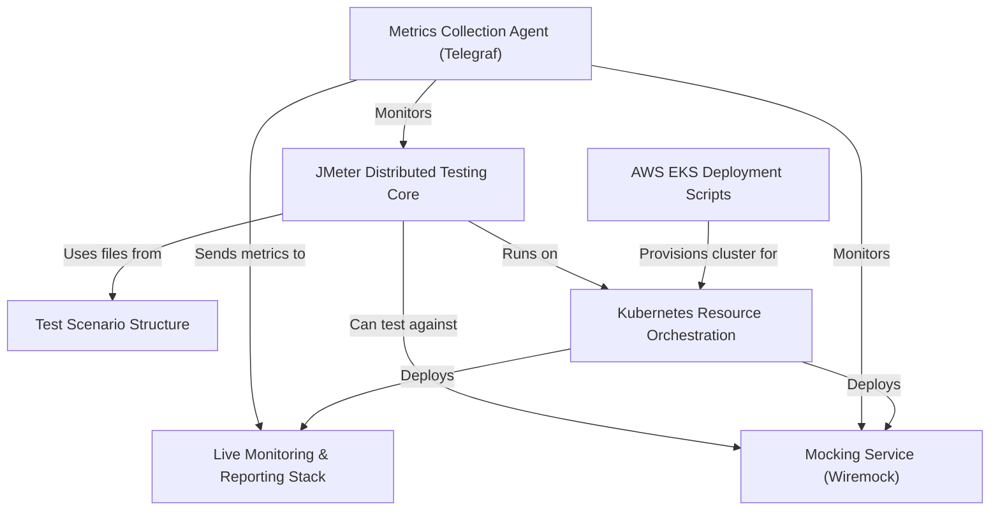

# Tutorial: jmeter-k8s-starterkit

This project provides a **starter kit** for running *Apache JMeter* load tests within a *Kubernetes* cluster.
It simplifies setting up a **distributed testing environment**, including **JMeter master and slaves**, and integrates a **live monitoring stack** (InfluxDB + Grafana) with automatic metrics collection (Telegraf).
It also offers optional **mocking** capabilities (Wiremock) and includes scripts for easy deployment on **AWS EKS**.

**Source Repository:** [None](None)

## Chapters

1. [JMeter Distributed Testing Core
](01_jmeter_distributed_testing_core_.md)
2. [Test Scenario Structure
](02_test_scenario_structure_.md)
3. [Kubernetes Resource Orchestration
](03_kubernetes_resource_orchestration_.md)
4. [Live Monitoring & Reporting Stack
](04_live_monitoring___reporting_stack_.md)
5. [Metrics Collection Agent (Telegraf)
](05_metrics_collection_agent__telegraf__.md)
6. [Mocking Service (Wiremock)
](06_mocking_service__wiremock__.md)
7. [AWS EKS Deployment Scripts
](07_aws_eks_deployment_scripts_.md)

---

Generated by [AI Codebase Knowledge Builder](https://github.com/The-Pocket/Tutorial-Codebase-Knowledge)